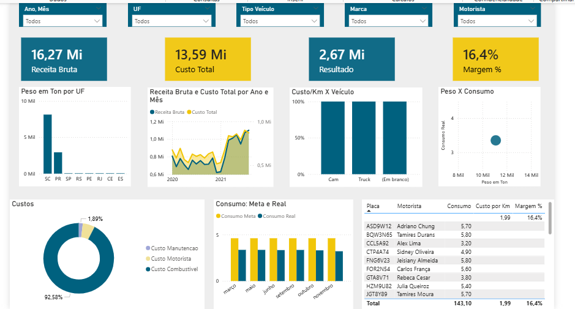

# 🚚 Dashboard de Gestão de Frotas - UAI Entregas




## 📌 Visão Geral do Projeto
Este repositório contém a solução desenvolvida para o Business Case da **UAI Entregas**, empresa de logística sediada em Uberlândia-MG. O objetivo do projeto foi criar um dashboard estratégico que permitisse ao gestor de frotas monitorar a saúde financeira da operação e a eficiência dos ativos.

---

## 📊 Indicadores de Performance (KPIs)
O relatório foi construído para responder a perguntas críticas de negócio, divididas em três pilares:

### 1. Saúde Financeira
* **Receita Bruta:** Faturamento total dos fretes realizados.
* **Custo Total:** Soma das despesas com Combustível, Manutenção e Motoristas.
* **Resultado & Margem %:** Lucratividade real após todos os custos operacionais.

### 2. Eficiência Operacional
* **Custo por Km Percorrido:** Métrica para comparação de eficiência entre diferentes categorias de veículos.
* **Consumo Real vs. Meta:** Comparativo entre o consumo aferido no diário de bordo e a meta de fábrica (km/l).
* **Custo Diário por Veículo:** Impacto financeiro de cada ativo por dia útil trabalhado.

### 3. Produtividade de Carga
* **Resultado por Tonelada:** Rentabilidade líquida baseada no peso transportado.
* **Receita por Tonelada:** Valor de frete gerado por cada tonelada de carga.

---

## 🛠️ Detalhes Técnicos

### Modelagem de Dados (Star Schema)
Utilizei a arquitetura de **Esquema Estrela** para garantir a performance do modelo e integridade dos filtros:
* **Tabelas Fato:** `Dados de Frete` e `Diário de Bordo`.
* **Tabelas Dimensão:** `dClientes`, `dMotoristas`, `dVeiculos` e `dCalendario`.

### Inteligência DAX
Um dos grandes desafios técnicos foi o cálculo do **Custo Diário por Veículo**, onde foi necessário isolar apenas os dias úteis (Segunda a Sexta) para uma média justa.

```dax
-- Medida para filtrar apenas dias úteis
Qtd Dias Uteis = 
CALCULATE(
    COUNTROWS('dCalendario'),
    'dCalendario'[DiaSemanaNumero] <= 5
)

-- Medida de Custo Diário
Custo Diario por Veiculo = 
DIVIDE(
    [Custo Total], 
    [Qtd Dias Uteis] * [Qtd Veiculos], 
    0
)

```
---

## 🎨 Design e Storytelling
O design segue o branding oficial da **UAI Entregas**:
* **Azul Petróleo (#00617F):** Utilizado para elementos de estrutura, ícones e cabeçalhos.
* **Amarelo Destaque (#F1C609):** Utilizado para dar visibilidade aos KPIs de Resultado e alertas críticos.

---

## 🚀 Como Visualizar
1. Baixe o arquivo `.pbix` localizado na pasta principal deste repositório.
2. Certifique-se de ter o **Power BI Desktop** instalado em sua máquina.
3. Abra o arquivo e utilize os filtros laterais para navegar e explorar os dados por **Mês**, **Marca** e **Tipo de Veículo**.

---

## 👤 Autor
**Karla Renata** *Social Media Strategist & Estudante de Ciência da Computação (Foco em Análise de Dados)*

[](https://www.linkedin.com/in/karlarenata-rosario) 
[](https://karlarenatadev.github.io/portfolio-karla-renata/)
